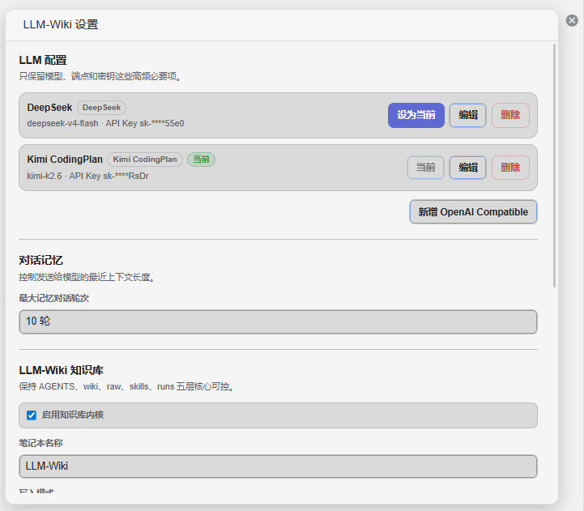
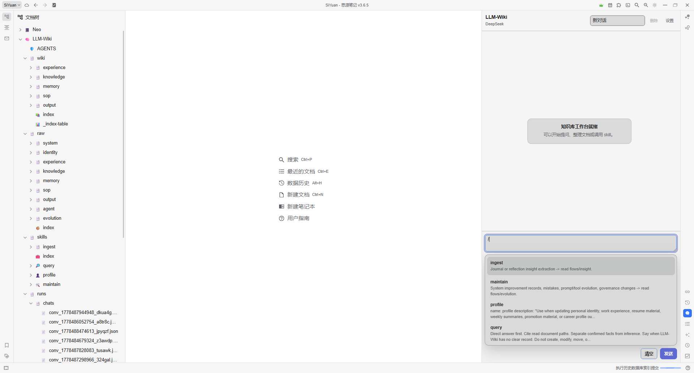
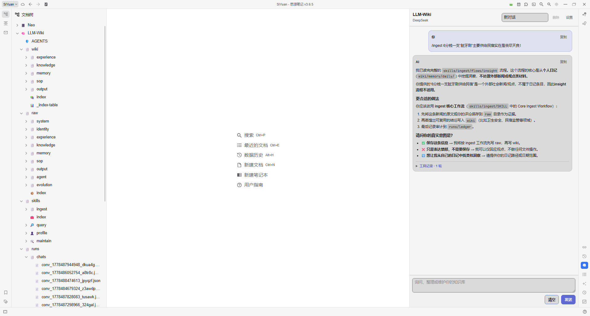

# Siyuan Addon: LLM-Wiki

> 基于 AI 的个人 LLM-Wiki 思源插件：用 ReAct 智能体、MCP 工具调用和自定义 Skills，在思源笔记中蒸馏、查询、维护个人知识库。

## 示例

| LLM-Wiki 设置 | Skill 面板 | 知识问答与工具调用 |
|---|---|---|
|  |  |  |

## GitHub 描述建议

基于 AI 的个人 LLM-Wiki 思源插件：用 ReAct 智能体、MCP 工具调用和自定义 Skills，在思源笔记中蒸馏、查询、维护个人知识库。

## 这个插件是什么

Siyuan Addon 不是单纯的侧边聊天窗口，而是一个作用于思源笔记的个人 LLM-Wiki 工作台。它把你的思源笔记本当作可读、可写、可审计的知识库，让 AI 能在受控边界内读取资料、沉淀结论、执行自定义工作流，并把结果落回思源。

它的核心目标是：让个人知识库从“存了一堆文档”变成“能被 AI 查询、蒸馏、维护和持续演化的个人知识系统”。

## 核心能力

- AI 侧边 Dock：在思源右侧提供常驻问答入口，支持新对话、历史会话、复制回答和停止生成。
- 个人 LLM-Wiki：默认围绕 `LLM-Wiki` 笔记本工作，读取策略、索引、skill 和相关知识文档。
- 知识查询：优先查询 `wiki` 层的结构化知识；用户要求原文、证据、全文或追溯时再回查 `raw` 层。
- 知识蒸馏：可把原始材料、聊天结论、工作经验、反思和流程记录整理成可复用的 wiki 文档。
- 自定义 Skills：通过 `/` 唤起 skill 面板，从 `LLM-Wiki/skills` 读取带 `SKILL` 入口文档的能力定义。
- ReAct 智能体：支持多轮推理、工具选择、工具调用、Observation 回读、参数修复和重复调用防护。
- MCP 工具调用：支持发现并调用 stdio、SSE、Streamable HTTP MCP Server 暴露的工具。
- 思源文档联动：回答中可渲染 `[[文档标题]]`、`siyuan-doc://` 和 wiki/raw/runs/skills 路径引用。
- 写入审计：成功写入、编辑、创建或更新后自动生成“实际变更清单”，并可记录到 `runs/ledger`。
- 会话归档：聊天记录写入 `LLM-Wiki/runs/chats`，插件重载后可继续查看历史会话。

## LLM-Wiki 五层结构

插件默认使用 `LLM-Wiki` 笔记本，并把知识库划分为五层：

| 层级 | 作用 |
|---|---|
| `AGENTS` | 知识库规则、角色、边界和默认策略 |
| `wiki` | 已蒸馏、可复用、面向查询的结构化知识 |
| `raw` | 原始材料、证据、上下文和可追溯来源 |
| `skills` | 自定义 AI 能力、工作流和触发说明 |
| `runs` | 会话、执行记录、写入台账和审计信息 |

推荐把“事实和证据”先放入 `raw`，再把稳定结论沉淀到 `wiki`。这样既能追溯来源，也能让日常问答保持高信噪比。

## Skills 如何工作

每个 skill 建议放在 `LLM-Wiki/skills/<skill-name>/SKILL` 下。插件会扫描 `skills` 目录，只把存在 `SKILL` 入口文档的目录识别为可用 skill。

使用方式：

1. 在输入框键入 `/`。
2. 从弹出的 skill 面板选择能力。
3. 输入目标，例如“整理这段经历”“归档这条经验”“查询我的能力清单”。
4. 智能体会读取对应 `SKILL` 文档，并按文档定义调用 MCP 工具执行。

skill 可以用来定义个人工作流，例如摄入资料、维护身份画像、整理经历、查询知识、生成周报、沉淀 SOP 或复盘经验。

## ReAct 与 MCP

插件内置 ReAct 风格的 Agent Runtime。它会根据用户目标和可用工具 schema 自主规划下一步：

1. 判断是否需要工具。
2. 选择 MCP 工具和结构化参数。
3. 执行工具调用。
4. 读取 Observation。
5. 基于结果继续查询、写入或给出最终回答。

当前支持的 MCP Server 类型：

- `stdio`
- `SSE URL`
- `Streamable HTTP URL`

启用的 MCP Server 会被视为可信工具来源。LLM-Wiki 内核还提供工具策略：支持 server/tool 白名单，写入模式可设为自动安全、草案优先或只读；删除、移动、重命名等高风险操作会在 auto-safe 模式下被阻止。

## 模型配置

插件支持多个 LLM Profile，并可在设置中切换当前模型：

- DeepSeek
- Kimi CodingPlan
- OpenAI Compatible

OpenAI Compatible 可填写自定义 Base URL，适合接入兼容 OpenAI Chat Completions 协议的模型服务。

## 安全边界

- LLM 和 MCP 配置保存在思源插件私有数据中。
- 只有启用的 MCP Server 才会被发现和调用。
- 写入、编辑、创建等操作必须通过 MCP 成功执行后，AI 才能声称“已记录”或“已保存”。
- auto-safe 模式允许新增、追加、更新，阻止删除、移动、重命名等高风险操作。
- 运行轨迹以“工具记录”形式折叠展示；复制回答时只复制最终回答，不带内部工具轨迹。

## 开发

```powershell
npm install
npm run typecheck
npm run agent:check
npm run chat:flow:check
npm run build
```

常用脚本：

| 命令 | 说明 |
|---|---|
| `npm run dev` | Vite watch 构建 |
| `npm run build` | 生成思源插件入口文件 |
| `npm run typecheck` | TypeScript 类型检查 |
| `npm run agent:check` | Agent Runtime 静态契约检查 |
| `npm run chat:flow:check` | 聊天流程静态契约检查 |

## 当前定位

这是一个个人优先的 AI 知识库插件，更适合愿意把思源作为长期知识底座的人使用。它不是为了替代思源本身，而是把 LLM、MCP、ReAct 和自定义 Skills 接到思源之上，让笔记可以被查询、被整理、被验证、被沉淀。
